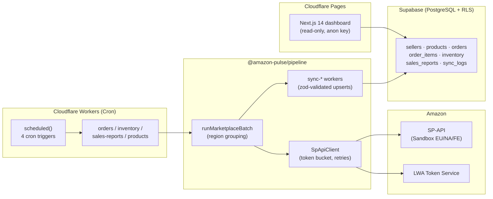

# amazon-pulse

> Production-grade SP-API (Selling Partner API) data pipeline for Amazon **EU/UK** sellers — sandbox-first portfolio build.

Fetches orders, inventory, sales reports, and product catalog data from Amazon's Selling Partner API and consolidates them into a Supabase (PostgreSQL) warehouse, with a small Next.js dashboard for observability and a Cloudflare Workers cron deployment for scheduling.

**Status**: Wave 1 complete (sandbox-only). Production endpoints are intentionally not exercised; switching them on is a separate, deliberate engagement.

---

## Live Demo

- **Production:** [amazon-pulse.pages.dev](https://amazon-pulse.pages.dev) (Sandbox-only mode)

## Portfolio Specification

- [日本語仕様書](./PORTFOLIO_SPEC_JP.md)
- [English Specification](./PORTFOLIO_SPEC_EN.md)

---

## What it does

- 🛒 **Orders** — incremental sync of `getOrders` + `getOrderItems`, every 6 hours.
- 📦 **Inventory** — FBA `getInventorySummaries` snapshot, every 6 hours (offset 15 min).
- 📊 **Sales reports** — daily `GET_SALES_AND_TRAFFIC_REPORT` aggregation (per ASIN).
- 🗂️ **Catalog** — weekly `searchCatalogItems` refresh of titles / brand / list price.

Each scheduled run produces one `sync_logs` row per (seller, marketplace, job) so partial failures stay visible. A single orchestrator run shares a `job_run_id` across all of its rows.

## Architecture



**Single Worker, four cron triggers** — see [`packages/cloudflare-worker/wrangler.toml`](packages/cloudflare-worker/wrangler.toml).

## Tech stack

| Layer        | Choice |
|--------------|--------|
| Language     | TypeScript 5.4 (strict + `noUncheckedIndexedAccess`) |
| Runtime      | Node.js 20+ for the pipeline; Cloudflare Workers (`nodejs_compat`) for the cron |
| Database     | Supabase / PostgreSQL (ap-northeast-1) |
| Scheduler    | Cloudflare Workers Cron Triggers (Free plan, 4 triggers) |
| HTTP         | axios + axios-retry |
| Rate limiting| token bucket per `(operation, region)` (see `packages/pipeline/src/lib/`) |
| Validation   | zod |
| Frontend     | Next.js 14 App Router + Tailwind |
| Tests        | Vitest (99 unit tests + 1 sandbox integration) |

## Key features

- ✅ **Multi-region** — automatic grouping by SP-API region (EU 14 marketplaces, NA, FE references).
- ✅ **Idempotent upserts** — UNIQUE constraints (`(marketplace_id, amazon_order_id)` etc.) plus `FakeSupabase` test coverage that enforces them in-memory.
- ✅ **Token bucket rate limiting** — operation × region buckets with FIFO waiters and 429-aware drain (`retryAfter` from the response steers the bucket).
- ✅ **Encrypted refresh tokens at rest** — AES-256-GCM, versioned ciphertext prefix (`v1:` / `enc:`).
- ✅ **Partial failure isolation** — one marketplace failing never aborts the batch; every batch always emits N `sync_logs` rows tied by `job_run_id`.
- ✅ **Sandbox-first** — no live tokens are required to clone, run tests, or run the demo dashboard.
- ✅ **Row Level Security** — frontend uses the public `anon` key; only sellers flagged `is_demo = true` are visible (migration `0003`).

## Demo

Live demo: _(to be filled in once Cloudflare Pages deploy is wired — see "Deployment" below)_

The dashboard reads from a small synthetic dataset (`infrastructure/supabase/seed.sql`) covering two demo sellers across DE / FR / IT / UK marketplaces.

## Repository layout

```
packages/
  pipeline/                 Node.js sync workers + SP-API client
    src/
      lib/                  encryption, lwa-auth, sp-api-client, token-bucket,
                            sp-api-endpoints, sync-helpers, supabase-client
      workers/              sync-orders, sync-inventory, sync-sales-reports,
                            sync-products
      schemas/              zod schemas (orders, inventory, reports, catalog, lwa)
    tests/                  56 tests (10 lib + 16 worker + 30 misc)
  cloudflare-worker/        Cron entrypoint (Workers)
    src/
      index.ts              scheduled() handler + dispatch
      env.ts                process.env shim for nodejs_compat
      handlers/             one per cron job
    wrangler.toml           4 cron triggers (orders / inventory / reports / products)
    tests/                  20 tests
  frontend/                 Next.js 14 App Router dashboard
    app/                    `/` and `/sellers/[sellerId]`
    components/             SellerCard, MarketplaceTable, SyncStatusBadge,
                            DemoBanner, ui/ (Card, Badge, Table)
    lib/                    supabase client, queries, format helpers
    tests/                  24 tests
infrastructure/
  supabase/
    migrations/             0001 initial · 0002 sync columns · 0003 demo RLS
    seed.sql                synthetic demo data
.github/
  workflows/                ci.yml · keepalive.yml
```

## Getting started

```bash
# 1. Install workspaces
npm install

# 2. Copy environment templates
cp .env.example .env.local
cp packages/frontend/.env.example packages/frontend/.env.local

# 3. Apply migrations + seed against your Supabase project
psql "$SUPABASE_DB_URL" -f infrastructure/supabase/migrations/0001_initial_schema.sql
psql "$SUPABASE_DB_URL" -f infrastructure/supabase/migrations/0002_phase2_sync_columns.sql
psql "$SUPABASE_DB_URL" -f infrastructure/supabase/migrations/0003_phase5_demo_access.sql
psql "$SUPABASE_DB_URL" -f infrastructure/supabase/seed.sql

# 4. Run tests + typecheck
npm run typecheck
npm test

# 5. Run the dashboard locally
npm run frontend:dev    # → http://localhost:3000
```

## Deployment

### Frontend → Cloudflare Pages

The simplest path (no GitHub Actions secret needed): connect this repository in the **Cloudflare Pages dashboard** with the build settings below.

| Setting | Value |
|---|---|
| Framework preset | Next.js |
| Build command | `npm run build --workspace @amazon-pulse/frontend` |
| Build output | `packages/frontend/.next` |
| Root directory | _(repository root)_ |
| Node version | `20` |
| Env vars | `NEXT_PUBLIC_SUPABASE_URL`, `NEXT_PUBLIC_SUPABASE_ANON_KEY` |

The anon key is **safe** to ship to the browser: every demo-readable table has a `is_demo = true` policy (see `infrastructure/supabase/migrations/0003_phase5_demo_access.sql`).

Alternatively, if you prefer GitHub Actions, push a workflow that runs `wrangler pages deploy packages/frontend/.next` after `npm run build` and stores `CLOUDFLARE_API_TOKEN` + `CLOUDFLARE_ACCOUNT_ID` in repository secrets.

### Cron → Cloudflare Workers

```bash
cd packages/cloudflare-worker

# Set the secrets (run once per environment)
wrangler secret put SUPABASE_URL
wrangler secret put SUPABASE_SERVICE_ROLE_KEY
wrangler secret put SP_API_CLIENT_ID
wrangler secret put SP_API_CLIENT_SECRET
wrangler secret put ENCRYPTION_KEY

# Optional: override defaults
wrangler secret put SP_API_PRODUCTION   # set to "true" when graduating off sandbox

# Deploy
wrangler deploy
```

The 4 cron triggers in `wrangler.toml` will start firing on the schedules listed there. The Free plan allows up to 5 triggers; one slot remains free for future jobs (e.g. a daily report-document-cleanup task).

If you prefer GitHub Actions for the Worker as well, store `CLOUDFLARE_API_TOKEN` + `CLOUDFLARE_ACCOUNT_ID` and run `wrangler deploy` from a CI step on `push` to `main`.

## Operational notes

### Encryption key

Refresh tokens are encrypted with AES-256-GCM (versioned by ciphertext prefix). Generate the key once:

```bash
openssl rand -base64 32
```

Add the result to `.env.local` and to the Worker via `wrangler secret put ENCRYPTION_KEY`.

### Supabase keepalive

Free-tier Supabase projects auto-pause after 7 days of inactivity. `.github/workflows/keepalive.yml` issues a single anon REST request to `sellers` every 3 days. Configure these repo secrets in **Settings → Secrets and variables → Actions**:

| Secret | Purpose |
|---|---|
| `SUPABASE_URL` | e.g. `https://xxxxxxxxxxxx.supabase.co` |
| `SUPABASE_ANON_KEY` | public anon key (RLS still applies) |

### CI

`.github/workflows/ci.yml` runs `npm run typecheck` + `npm test` on every PR. Sandbox integration tests are auto-skipped without `SP_API_*` secrets, so the build is green out of the box.

## Wave 1 phase log

| Phase | Scope | Tests added |
|---|---|---|
| 1 | LWA OAuth + SP-API client wrapper (sandbox) | 9 |
| 2 | Sync workers: orders / inventory / sales-reports / products | 16 |
| 3 | Token-bucket rate limiting + exponential backoff retries | 12 |
| 4 | Multi-region routing (EU 14 marketplaces, NA / FE references) | 12 |
| 5 | Next.js dashboard + Cloudflare Workers cron deploy | 50 |

Total: **99 unit tests passing**, 1 sandbox integration test skipped without credentials.

## License

MIT — see [`LICENSE`](./LICENSE).
